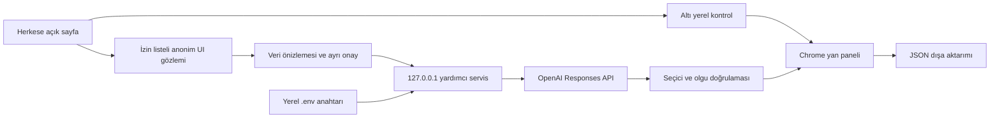

# UX Kanıt — Kanıta bağlı UX ön değerlendirmesi (0.8.3)

Bu, Deneyim Mühendisliği ödevi için geliştirilen ilk iskelettir. Tam teslim sürümü değildir.

## Chrome'a yükleme

1. Chrome adres çubuğunda `chrome://extensions` açın.
2. Sağ üstte Geliştirici modu seçeneğini açın.
3. Paketlenmemiş öğe yükle düğmesine basın.
4. Bu README ile manifest.json dosyasının bulunduğu ux-kanit klasörünü seçin.
5. Herkese açık bir web sayfası açın. Eklentiler menüsünden UX Kanıt simgesine basın.
6. Sayfanın uygunluğunu doğrulayın ve Sayfayı kontrol et düğmesine basın.

## Bu adımın kapsamı

Manifest V3, yan panel ve kullanıcı tarafından başlatılan altı yerel kontrol: sayfa dili, görsel alternatif metni, form etiketi, hedef boyutu, düğme/bağlantı adı ve metin kontrastı. Form değerleri, çerezler ve klavye vuruşları okunmaz. Etiket ve kontrol metinlerinin yalnızca varlığı yerelde incelenir; ham içerikleri rapora alınmaz veya gönderilmez. Yerel tarama ağ isteği ve API anahtarı gerektirmez. Ayrı AI analizi yukarıdaki onay akışına tabidir. Parola alanı görülen sayfa engellenir; diğer hassas sayfalar için kullanıcı doğrulaması gerekir. Parola alanı kontrolü hassas sayfaları eksiksiz tanımaz.

## Yerel testler

```powershell
node --test tests/*.test.cjs
```

0.8.0 geliştirmesinde 31 hesaplama/kontrat testi ve 1 yerel HTTP erişim testi geçti. HTTP testi sahte anahtar kullanır ve OpenAI isteği yapmaz. Bunlar gerçek sitelerin manuel denetimi veya gerçek API doğrulaması yerine geçmez.

## Metin kontrastı

Doğrudan metin düğümü olan görünür öğelerin CSS renkleri yerelde incelenir; metin içerikleri rapora eklenmez. Form kontrolleri, düzenlenebilir içerik ve devre dışı kontroller kapsam dışıdır. Düz opak RGB arka plan bir üst öğeden çözülebiliyorsa oran=(L_açık+0.05)/(L_koyu+0.05) hesaplanır. sRGB kanalları c<=0.04045 için c/12.92, aksi halde ((c+0.055)/1.055)^2.4 ile lineerleştirilir; L=0.2126R+0.7152G+0.0722B. Eşik normal metin için 4.5, en az 24 CSS px veya en az 18.6667 CSS px ve 700 ağırlıktaki metin için 3'tür. Karşılaştırmada oran yuvarlanmaz.

Görsel/gradyan arka plan, saydam renk, opaklık efekti, filtre, blend, transform, metin gölgesi, üretilmiş sözde öğe veya bilinmeyen canvas rengi ölçülemeyen sayılır. Bu muhafazakâr uygulama ölçüm kapsamını azaltır. Üst üste binen kardeşler, videolar, özel boyama, logo istisnaları, hover/focus durumu, placeholder ve görsel içindeki metin ayrıca incelenmelidir. Ölçümler adaydır; tam WCAG uygunluk denetimi değildir. Kaynak: https://www.w3.org/WAI/WCAG22/Understanding/contrast-minimum.html

0.6.1 düzeltmesi: Metin öğesinin sınır kutusu görünür img/video/canvas/svg sınır kutusuyla örtüşürse oran hesaplanmaz. Böylece kardeş öğe olarak konumlandırılmış fotoğrafı CSS arka plan rengi sanan yanlış ölçüm engellenir. Katman sırası çözülmediği için ilgisiz örtüşmeler de ölçümü dışarıda bırakabilir; bu, bilinçli olarak muhafazakâr bir yaklaşımdır.

## Henüz tamamlanmayanlar

Başarılı gerçek LLM analizi, altı ilkenin yeterli kanıtla değerlendirilmesi, birleşik skor, LLM tekrar ölçümleri ve gerçek LLM halüsinasyon kontrolü henüz tamamlanmadı. API isteği kota/bakiye veya hız sınırı hatasıyla sonuçlandı. Kullanıcının kararıyla LLM bölümü sona bırakıldı. axe-core entegre edilmedi; altı özel yerel kontrol tam WCAG 2.2 AA taraması değildir. Üç sitenin ön raporları mevcut, nihai LLM raporları bekleniyor. Demo senaryosu hazır; video henüz kaydedilmedi.

## Doğrulama sonuçları

Gerçek kullanıcı raporları ve kanıtlar [reports](reports/README.md) ve [manuel denetim](docs/manuel-denetim.md) belgelerinde saklanır. Ön raporların deterministik skorları Acıbadem 76.23, Hepsiburada 85.81, İBB 73.48'dir. Bunlar farklı sayfa anlık görüntüleridir; birbirleriyle tutarlılık testi sayılmaz. Ataşehir bilgi sayfasına bağlam yoluyla ilişkilendirilen ek 0.8.1 raporu 80.31 ön skor ve 81 aday içerir. Kontrast kapsamı yalnızca %28.13'tür. Skorlar formülden yeniden hesaplandı; bu işlem adayları kesin ihlal olarak doğrulamaz.

| İstenen doğrulama | Gerçek sonuç | Durum / sınır |
|---|---|---|
| Aynı sayfada üç LLM analizi | Başarılı LLM yanıtı yok | Sapma hesaplanmadı; sıfır olduğu iddia edilmez |
| Klavye + ekran okuyucu görevi | Kullanıcı fare kullanmadan Ataşehir Hastanesi bilgi sayfasına ulaştı; Tab odağını görebildiğini bildirdi | Kullanıcı bildirimi ve hedef ekran görüntüsü; tarayıcı/ekran okuyucu sürümü ve ses kaydı yok |
| Araç / manuel karşılaştırma | Arama ve Mesajınız alanlarının amacı duyuruldu; telefon alanında yalnız 5XX biçimi duyuruldu | İlk iki alan tamamen adsızlık yorumu bakımından olası yanlış alarm; telefon etiketi adayı destekleniyor. Ad kaynakları DOM'da ayrıca doğrulanmalı |
| LLM halüsinasyon kontrolü | Seçici/olgu doğrulama kodu yerel testlerden geçti | Gerçek LLM bulgusu yok; oran hesaplanmadı. Birim testi gerçek saha testi yerine geçmez |
| Büyükanne senaryosu | Kullanıcı hastane bilgi sayfasında büyük telefon bilgisini zorlanmadan buldu | Yaşlı katılımcı testi değil; toplam gezinim süresi ölçülmedi |
| Gece 3 senaryosu | Kullanıcı yaklaşık 3 dakika arayıp acil servis çalışma saatini bulamadı | Süre kullanıcı tahmini; bilginin tüm sitede yokluğunu veya servisin kapalı olduğunu kanıtlamaz. Yerel kontroller bunu yakalamıyor |

Ana sayfada bağlantının yalnızca 'Detaylı Bilgi' diye duyurulması bağlamsal kullanılabilirlik adayıdır; kesin WCAG ihlali olarak sayılmadı. 81 adayın tamamı denetlenmediğinden genel doğruluk ve yanlış alarm yüzdesi hesaplanmadı. 0.8.1 vurgulama konum hatası gerçek görüntüyle kaydedildi; 0.8.2 güncel öğe konumunu takip eder. Yeniden test görüntüsünde çerçeve arama alanını doğru gösterdi.

## Teslim dosyaları

- GitHub: https://github.com/Mervebeyazal/ux-kanit — geliştirme aşamalarına ait birden fazla commit bulunur.
- Üç kategori raporu ve ek manuel karşılaştırma: [Raporlar](reports/README.md).
- Manuel görevler ve ekran görüntüleri: [Denetim kaydı](docs/manuel-denetim.md).
- [Demo senaryosu ve kayıt adımları](docs/demo-senaryosu.md) — video teslimi bekleniyor.
- [Yansıtma notu taslağı](docs/yansitma-notu.md) — öğrencinin okuyup kendi deneyimiyle doğrulaması gerekir.
- [Son teslim kontrolü](docs/teslim-kontrol.md).

## AI yardımcı servisini çalıştırma

Node.js 24 gereklidir. Proje klasöründe .env.example dosyasından yerel .env oluşturup OPENAI_API_KEY değerini yalnızca kendi bilgisayarınızda girin. .env Git tarafından hariç tutulur. Anahtarı eklentiye, rapora, ekran görüntüsüne veya repoya koymayın.

```powershell
node --env-file=.env server/server.cjs
```

Servis yalnızca 127.0.0.1:8787 adresinde dinler. Terminalde gösterilen oturuma özel yerel bağlantı kodunu paneldeki ilgili alana girin; bu OpenAI API anahtarı değildir. Servis açık kalmalı. Sonra yerel analiz, AI önizleme, gönderilecek paketi inceleme ve ayrı onay sırasını takip edin. Onay verilene kadar API isteği yapılmaz. Servis CORS ile yalnızca chrome-extension kökenlerini kabul eder; ayrıca rastgele bağlantı kodu gerekir. Oturum başına 20 istek, tek eşzamanlı istek ve 350 KB gövde sınırı vardır. Otomatik yeniden deneme yoktur. Gerçek API çağrısı kullanıcının API hesabından ücret/kota tüketebilir.

Varsayılan sabit model gpt-4.1-mini-2025-04-14, temperature=0, promptVersion=norman-static-v1. Responses API, store=false ve strict JSON Schema kullanılır. Anahtar sadece servis ortam değişkeninden okunur. Günlüklerde anahtar, gövde ve sayfa metni yoktur. Açık .env düz metin yerel dosyadır; işletim sistemi hesabına erişimi olan kişilerden koruma sağlamaz. Dosyayı paylaşmayın.

## AI kanıt ve mahremiyet sınırları

### Ücretli API'ye yerel alternatif — 0.8.3

Servis artık `UX_LLM_PROVIDER=ollama` ile 127.0.0.1:11434 yerel Ollama chat API'sini kullanabilir. Bu modda OpenAI anahtarı gerekmez. Ollama ve yerel model ayrıca kurulmalıdır; mevcut bilgisayarda kurulum veya gerçek model yanıtı henüz doğrulanmadı. Küçük model çıktılarının kalitesi ayrıca ölçülmelidir. Cloud modeller kullanmayın; Ollama'nın cloud erişimini kapatın. Model indirme internet gerektirir; model çıkarımı için yardımcı servis yalnızca loopback adresine istek yapar. Rapor `provider` ve `llmDestination` bilgisini saklar; genel `localOnly` bayrağı AI çalıştığında muhafazakâr olarak false kalır.

Ollama kurulmuş ve `qwen3:1.7b` yerel modeli indirilmişse, anahtarı okumadan PowerShell'de:

```powershell
$env:UX_LLM_PROVIDER='ollama'
$env:OLLAMA_MODEL='qwen3:1.7b'
node server/server.cjs
```

Aynı panel onayı, seçici/olgu doğrulaması ve yetersiz kanıt için null skor kuralları geçerlidir. Sıcaklık 0 ve seed 42 tekrar koşulu olarak kaydedilir; kararlılık garantisi değildir. 180 saniye model zaman aşımı ve 190 saniye panel bekleme sınırı vardır. Statik Geri Bildirim ilkesi hâlâ puanlanmaz; bu alternatif tam altı ilke görevini tek başına tamamlamaz. Ollama adaptörünün üç testinde sahte yanıtlar kullanıldı; toplam 35 yerel test geçti, gerçek LLM saha başarısı iddia edilmez.

Resmî kaynaklar: [Ollama chat API](https://docs.ollama.com/api/chat), [JSON şema desteği](https://docs.ollama.com/capabilities/structured-outputs).

### Tekrarların hesaplanması

En az üç ayrı gerçek analiz raporu alındıktan sonra:

```powershell
node server/compare-repeats.cjs rapor1.json rapor2.json rapor3.json
```

Araç aynı snapshot hash/model/provider/prompt/sıcaklık/seed koşulunu ve ayrı istek kimliklerini kontrol eder. Her ilke ve mevcut AI ön toplamı için skor aralığı (max−min), ortalama ve popülasyon standart sapmasını hesaplar; null skorları karşılaştırmaz. 10 puanı aşan aralık işaretlenir. İlgili gerçek bulgu farklarının nedenleri ve çözüm sonrası tekrar ölçümü ayrıca raporlanmalıdır. Mevcut yalnız yerel raporlarla çalıştırıldığında eksik LLM sonucu nedeniyle reddetti; gerçek tekrar sonucu henüz yoktur.

İlk 150 uygun UI öğesinin yapısal seçicileri, ölçümleri, ad kaynağı varlığı, required/disabled/expanded durumu ve önceden belirlenmiş genel UI kelimeleri gönderilir. Keyfi metin, kişi adı, URL, form değeri, seçenek değeri, placeholder veya ekran görüntüsü gönderilmez. FormValue alanı yalnızca sabit [MASKED] işaretidir; gerçek değer okunup sonra maskelenmez. 'Ara', 'Randevu al' gibi ifadeler sadece sabit izin listesindeki tam eşleşmelerden seçilir. Önizlemede kişisel veri görürseniz gönderimi onaylamayın. Giriş yapılmış veya kişisel/sağlık verisi içeren sayfalar bu proje kapsamı dışında; parola kontrolünün eksik algılaması kullanıcı doğrulamasıyla tamamlanır.

Servis izin verilmeyen alanları reddeder; her AI bulgusunun seçicisini snapshot içinde arar ve factKey/factValueJSON eşleşmesini kontrol eder. Uydurulan seçici veya ölçüm, kabul edilen bulgu listesine girmez; reddetme nedeni JSON'da saklanır. Yanıt sonrası panel güncel örneklemde seçici ve aynı olguyu tekrar kontrol eder. Bu, AI yorumunun doğru olduğunu kanıtlamaz; yorum ekran okuyucu/manuel inceleme bekler. Snapshot dışında kalan seçici oranı ve güncel örneklem reddi ayrı tutulur. Güncel örneklemde bulunmamak, öğenin bütün DOM'da kesinlikle olmadığı anlamına gelmez.

## Norman skorları ve henüz eksik davranış kanıtı

Model her ilke için 0-100 veya kanıt yetersizse null döndürür. Rubrik: 90-100 az risk, 70-89 sınırlı risk, 40-69 belirgin sorun, 0-39 ciddi engel. Her skor gerekçe ve örneklemde bulunan observationSelectors gerektirir. İlgili ilkenin uydurma bulgusu varsa skor null yapılır. Bu sürüm tıklama veya form gönderimi yapmadığından Geri Bildirim davranışı gözlenmez; bu skor zorunlu olarak null tutulur. Diğer ilkeler de yalnızca statik kanıt kapsamındaki aday değerlendirmedir; etiket anlamları gizlenince Eşleme gibi ilkeler de belirsiz kalabilir.

AI statik ön toplamı L=Σ(skoru mevcut ilke puanları)/mevcut ilke sayısı; ilkeler eşit ağırlıklıdır. Mevcut ilke sayısı ve eksikler ayrıca gösterilir. Altı ilkenin tamamı değerlendirilemediyse birleşik toplam hesaplanmaz. Dolayısıyla 0.8.0 kapsamı ödevin tam davranış değerlendirmesini henüz karşılamaz; sonraki aşamada kullanıcı tarafından yapılan görevlerin kanıtlarıyla tamamlanmalıdır. Aynı snapshot hash, model, temperature ve prompt sürümü üç tekrarda kaydedilerek sapma ölçülmelidir; sıcaklık sıfır olması deterministik yanıt garantisi değildir.

## Mimari



Resmi API kaynakları: https://developers.openai.com/api/reference/overview ve https://developers.openai.com/api/docs/guides/structured-outputs

## Skor formülü ve gerekçe

Bu sürümün skoru doğrulanmış WCAG uygunluk puanı değil, aday bulgulara dayalı ön tarama göstergesidir. Her kategori için n ölçülen öğe sayısı, f aynı kategoride benzersiz seçiciye sahip aday sayısıdır: S=100×(1−f/n). n=0 ise S=null; ölçülemeyen öğeler başarı kabul edilmez. Sayfa dili kategorisinde n=1. Görsel için görünür görseller, form için incelenen görünür alanlar, hedef için ölçülen hedefler, ad için sınır nedeniyle belirsiz olmayan kontroller, kontrast için yalnızca güvenilir ölçülen metin öğeleri kullanılır. Ad ve kontrast için kapsam oranı n/(n+bilinmeyen) ayrıca JSON'da tutulur; bu diğer kapsam dışı DOM öğelerini kapsamaz.

| Kategori | Ağırlık |
|---|---:|
| Dil | 5 |
| Görseller | 15 |
| Form | 20 |
| Hedef boyutu | 15 |
| Kontrol adı | 20 |
| Kontrast | 25 |

Deterministik ön toplam D=Σ(w×S)/Σ(w), yalnızca skoru null olmayan kategoriler üzerinde hesaplanır. Payda availableWeight alanındadır. Form ve kontrol adları temel işlemleri, kontrast geniş metin okunabilirliğini etkilediği için daha yüksek ağırlık alır; bu ağırlıklar proje tasarım kararıdır, WCAG'nin resmi puan sistemi değildir. Öğe oranı kullanımı büyük sayfalarda salt bulgu sayısının puanı gereksizce düşürmesini önler. Şiddet bu sürümde inceleme önceliğini gösterir, formülde ayrıca çarpılmaz; kategoride aynı öğe iki kez cezalandırılmaz. Çok sayıda sorunsuz öğe önemli bir tek sorunun etkisini seyreltebilir; bu sınırlama nedeniyle kritik görevler ayrıca manuel denetlenir.

Birleşik toplam T=0.60D+0.40L'dir; altı Norman ilkesinden herhangi biri eksikse veya D/L yoksa T=null. Eksik ilke 0 veya 100 ile doldurulmaz. Statik AI ön ortalaması ayrı gösterilir, eksik kapsam birleşik skora gizlenmez. Skor modeli candidate-rate-v1 olarak sürümlenir; elle doğrulanmış ihlal skoru ile karıştırılmamalıdır.

## JSON dışa aktarımı

Başarılı analizden sonra JSON raporunu indir düğmesi sonuçları yerel dosyaya kaydeder. Raporda zaman, eklenti/model sürümü, kategori skorları, kapsam/sayılar, seçiciler, kanıtlar, öneriler ve manuel doğrulama durumu bulunur. Form değerleri ve sayfa metinleri yoktur. Adresin yalnızca origin kısmı kaydedilir; hassas yol/sorgu/fragment dışarı aktarılmaz. Test edilen herkese açık tam adres doğrulama notunda ayrıca kaydedilmeli. Yeni veya başarısız analiz eski raporu indirilebilir bırakmaz. JSON bir anlık görüntüdür; sayfa değişirse yeniden analiz gerekir. on-demand-highlight alanı vurgulamanın kullanılabilir olduğunu belirtir, her öğenin manuel doğrulandığını iddia etmez.

## Düğme ve bağlantı adı kontrolü

Ölçülebilen, etkin bağlantılar/düğmeler ve role=button/link kontrollerinde ad kaynaklarının varlığı incelenir. Mevcut aria-labelledby referansları önceliklidir; ardından aria-label, gizlenmemiş içerik (görsel alt ve SVG title dahil) ve title incelenir. Gizli doğrudan ad referansları da değerlendirilir. Form kontrollerinin değerleri okunmaz; ad metinleri rapora yazılmaz. Adaylar WCAG 4.1.2 ile ilişkilendirilir ancak kesin ihlal ilan edilmez. Bu, tam Accessible Name Computation uygulaması değildir: CSS sözde öğeleri, karmaşık iç içe ARIA referansları, özel bileşenler, iframe ve Shadow DOM kapsam dışıdır. Her kontrol için 1500 düğüm/60 derinlik sınırı vardır; sınır aşımı bulgu yerine belirsiz sayılır. Adın kalitesi, görünür metinle uyumu ve ekran okuyucu çıktısı ayrıca denetlenmelidir. Kaynak: https://www.w3.org/WAI/WCAG22/Understanding/name-role-value.html

## Eksik alternatif metin kontrolü

Görünür img öğeleri içinde alt niteliği bulunmayan ve alternatif ad ya da açık dekoratif semantik taşımayan öğeler raporlanır. alt="" otomatik ihlal sayılmaz; dekoratif görsellerde geçerlidir. Bulgu WCAG 1.1.1 ile ilişkilidir ancak kesin WCAG ihlali ilan edilmeden görselin amacı elle doğrulanmalıdır. Her bulguda yapısal CSS seçicisi, kanıt, şiddet ve öneri vardır. Sayfada göster düğmesi dört saniyelik geçici, tıklamaları engellemeyen çerçeve ekler. Sayfa öğelerine tıklamaz ve form göndermez. Form değerleri ve görsel adresleri toplanmaz. iframe, Shadow DOM, CSS arka planları ve alternatif ad kalitesi kapsam dışıdır.

## Form etiketi kontrolü

Görünür input, select ve textarea alanlarında metinli ilişkili label, dolu aria-label, metinli referansa çözülen aria-labelledby ve title varlığı kontrol edilir. Alan değerleri, varsayılan değerler ve seçili seçenekler okunmaz. Tam erişilebilir ad hesaplaması değildir; adaylar manuel doğrulanmalıdır. Görünür etiket ve erişilebilir ad farklı kontrollerdir: bu sürüm erişilebilir ad adayı yokluğunu WCAG 4.1.2 ile ilişkilendirir, yalnızca aria-label bulunmasını WCAG 3.3.2 için yeterli saymaz. Kaynak: https://www.w3.org/WAI/tutorials/forms/labels/

## Dokunma hedefi boyutu

Bağlantılar, düğmeler, görünür yerel form kontrolleri ve role=button/link öğeleri getBoundingClientRect ile ölçülür. Genişlik VEYA yükseklik 24 CSS px altındaysa aday raporlanır; tam 24 × 24 sınırın altı değildir. Sıfır boyutlu, gizli, inert, devre dışı veya pointer-events:none öğeleri hariç tutulur. Ham ölçümler bulguya eklenir; gösterim iki ondalıkla yapılır. Değerler okunmaz ve kontrol hiçbir öğeyi etkinleştirmez.

Bu bir sınır kutusu ölçümüdür; gerçek tıklanabilir şekli, üstü örtülmüş alanları, taşan alt öğeleri, çok satırlı bağlantıların birleşik alanını ve özel JavaScript tıklama alanlarını tam belirleyemez. Ekran dışında düzenlenen öğeler de ölçülebilir. Boyutu yeterli öğelere kesin uygunluk sonucu verilmez. WCAG 2.5.8'in aralık, eşdeğer kontrol, satır içi hedef, tarayıcı kontrolü ve zorunlu sunum istisnaları otomatik hesaplanmaz; küçük hedef adayları manuel doğrulanmalıdır. Kaynak: https://www.w3.org/WAI/WCAG22/Understanding/target-size-minimum.html

## Groq bağlantısı — 0.8.4

Groq seçeneği için yerel .env içinde UX_LLM_PROVIDER=groq ve GROQ_API_KEY değerini ayarlayın. Varsayılan model openai/gpt-oss-20b; Groq üzerinden çalışır, OpenAI API hesabı kullanmaz. Modeli ayrıca indirmek gerekmez. Aynı ayrı gönderim onayı ve seçici/olgu doğrulaması uygulanır. temperature=0, seed=42 ve systemFingerprint raporda saklanır. Ücretsiz hesap kotası garanti edilmez; 429 hatasında otomatik tekrar yoktur. Mevcut 38 yerel test geçti; Groq adaptörü sahte yanıtlarla sınandı, gerçek analiz henüz doğrulanmadı. Yan panel sürümü 0.8.4'tür.

Kaynaklar: [Groq JSON şema desteği](https://console.groq.com/docs/structured-outputs), [veri koşulları](https://console.groq.com/docs/your-data), [planlar](https://console.groq.com/docs/billing-faqs). Anahtarı paylaşmayın; .env repo dışında kalır. Bu sağlayıcı değişikliği statik Geri Bildirim kanıt eksikliğini çözmez.

### 0.8.5 — gerçek Groq 413 denemesi

Kullanıcı ilk Groq isteğinde HTTP 413 bildirdi; başarılı LLM yanıtı alınmadı. AI örneklemi tüm sağlayıcılarda ilk 150 yerine ilk 20 uygun UI öğesine düşürüldü (yerel altı kontrol kapsamı değişmedi). Groq çıktı bütçesi 7000 yerine 3500 token, bulgu sınırı promptta 3 oldu. Önizleme ve kayıt aynı küçültülmüş örneklemi içerir; seçici/olgu doğrulaması korunur. Bu değişiklik kapsamı azaltır; bütün sayfa için sonuç vermez. Yeniden saha testi bekleniyor. Önceki 150 öğe açıklamaları tarihsel sürüme aittir. Groq promptVersion norman-static-small-v2 olarak kaydedilir.

### 0.8.6 — güvenli hata ayrımı

İkinci Groq denemesinde genel doğrulama hatası bildirildi; kesin neden henüz bilinmiyor. Yeni hata kodları gözlem paketini, bağlantıyı, kesilmiş çıktıyı, geçersiz JSON'u ve ilke/kanıt sözleşmesini ayırır. Anahtar, istek gövdesi ve ham model metni hata çıktısına yazılmaz. Adaptörün üç testi geçti; yerel erişim testinin yeniden çalışması açık yardımcı servisin kullandığı 8787 portu nedeniyle başlatılamadı. Önceki başarılı test sonucu yeni saha denemesi yerine geçmez.

### 0.8.7 — altı ilke yanıt yapısı

Kullanıcı Groq yanıtının ilke/bulgu listesi biçimi kontrolünde reddedildiğini bildirdi. Groq şemasında principles listesi yerine altı adı ayrı zorunlu nesne anahtarı yapan yapı kullanıldı; adaptör bunu ortak doğrulayıcının listesine dönüştürür. Yetersiz kanıt null kalır, eksik skor doldurulmaz. Prompt sürümü norman-static-small-v3. Dört Groq testi ve on kanıt sözleşmesi testi geçti; yeni gerçek saha yanıtı bekleniyor.
